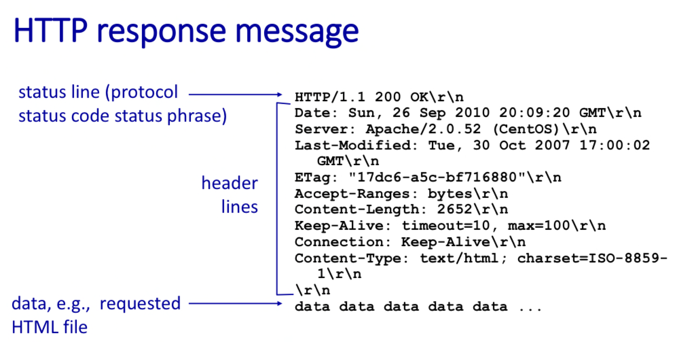

# 1장 요약

### 1.1개발자가 알아야 하는 것
많다......
#### 백엔드와 프론트엔드의 차이:
백엔드(Back-end): 서버 측 로직 및 데이터 처리를 담당하는 시스템 부분입니다. 데이터베이스 관리, 서버 로직 처리 등이 포함됩니다.

프론트엔드(Front-end): 사용자가 직접 상호작용하는 인터페이스의 개발을 담당합니다. 웹 페이지의 시각적 요소와 사용자 경험(UX) 디자인 등이 포함됩니다.

#### 클라이언트-서버 구조 및 P2P 구조:
- 클라이언트-서버 구조: 요청을 하는 클라이언트와 이를 수신하여 응답을 제공하는 서버로 구분됩니다.
- P2P(Peer-to-Peer) 구조: 모든 노드가 동등한 역할을 수행하며, 데이터나 리소스를 직접 공유할 수 있는 분산 네트워크 구조입니다.
- 이외에도 다양한 구조

#### 서버용 컴퓨터 운영체제 (GUI <-> CLI):
서버 관리에는 그래픽 사용자 인터페이스(GUI)보다는 명령줄 인터페이스(CLI)가 더 효율적인 경우가 많으므로, CLI 명령어에 익숙해지는 것이 중요합니다.

### 네트워크
#### Internet vs. internet:
- Internet은 대문자 'I'로 시작하며, 전 세계적으로 연결된 TCP/IP 기반의 주요 통신망을 의미합니다. 인터넷은 세계적으로 하나만 있으며, 우리가 일상적으로 사용하는 WWW(World Wide Web), 이메일, FTP 등이 이를 통해 작동합니다.

- internet은 소문자 'i'로 시작하며, 여러 개의 네트워크가 연결되어 있는 상태, 즉 '네트워크의 네트워크'를 의미합니다. 이 용어는 일반적으로 특정한 범위 내에서 여러 개의 네트워크가 상호 연결되어 있는 상황을 설명할 때 사용됩니다.

#### 계층(layering)
- 이해하고 관리하기 쉽게 하기 위해 복잡한 시스템을 분리된 여러 부분으로
- 상위 계층은 하위 계층이 제공하는 서비스의 세부 사항에 대해 알 필요x
- OSI(Open Systems Interconnection) 7계층 모델 

- **인터넷 프로토콜 스위트(흔히 TCP/IP 모델로 불림)의 5계층 모델**

#### 5계층 모델
- ##### 응용 계층 (Application Layer): 
    사용자가 네트워크에 접근할 수 있게 해주는 계층으로, HTTP, FTP, SMTP 등의 프로토콜이 포함됩니다. 사용자 인터페이스, 데이터베이스 관리, 이메일 전송 등 다양한 응용 프로그램 서비스를 제공합니다.
- ##### 전송 계층 (Transport Layer): 
    두 시스템(프로세스) 간의 데이터 전송을 관리합니다(process to process). TCP(Transmission Control Protocol)와 UDP(User Datagram Protocol)가 이 계층에 해당합니다. 데이터의 전송을 보장하며, 오류 검출 및 복구, 흐름 제어 등을 담당합니다.
- ##### 네트워크 계층 (Network Layer):
    데이터 패킷의 경로를 결정(host to host) 
    데이터를 소스에서 목적지까지 라우팅하는 기능을 담당합니다. IP(Internet Protocol)가 이 계층의 핵심입니다. 데이터 패킷의 경로를 결정하고, 다양한 네트워크 간의 통신을 가능하게 합니다.
- ##### 데이터 링크 계층 (Data Link Layer): 
    직접 연결된 노드들 사이의 데이터 전송을 담당
    이 계층은 프레임으로 데이터를 구성하고, MAC(Media Access Control) 주소를 사용하여 데이터를 전송합니다.
- ##### 물리 계층 (Physical Layer): 
    비트 전송
    하드웨어 전송 기술을 기반으로 한 계층으로, 전기적 신호를 통해 데이터를 전송합니다. 케이블, 카드, 다른 물리적 요소들이 이 계층에 해당됩니다.
### HTTP
#### HTTP의 주요 특징
- 비연결성(Connectionless): 
클라이언트가 서버에 요청을 보내고 서버가 응답을 보낸 후 연결을 바로 끊습니다. 이는 효율성을 높이지만, 각 요청이 독립적이라는 단점도 있습니다.

- 무상태(Stateless):
HTTP는 이전 요청을 기억하지 않습니다. 이는 서버가 클라이언트의 상태를 저장하지 않아서 간단하고 확장성이 높지만, 매 요청마다 필요한 모든 정보를 보내야 하므로 효율성이 떨어질 수 있습니다.

- 확장 가능: 
HTTP는 새로운 메소드와 헤더를 추가하여 기능을 확장할 수 있습니다. 이를 통해 웹 기술이 발전함에 따라 새로운 기능을 손쉽게 추가할 수 있습니다

#### http connection

- TCP 연결 수립: 
클라이언트는 서버의 IP 주소와 80번 포트를 대상으로 TCP 연결을 초기화합니다. 이 과정에서 TCP의 3-way handshake가 진행됩니다.
- HTTP 요청 전송: 
TCP 연결이 성공적으로 수립되면, 클라이언트는 HTTP 프로토콜을 사용해 요청(request)을 서버로 전송합니다. 이 요청에는 요청하는 웹 페이지나 자원의 경로, 요청 메서드(GET, POST 등), 헤더 정보 등이 포함됩니다.
- 서버 처리 및 응답: 
서버는 클라이언트의 HTTP 요청을 받아 처리한 후, 응답(response)을 HTTP 프로토콜로 클라이언트에 전송합니다. 이 응답에는 상태 코드(예: 200 OK, 404 Not Found), 응답 헤더, 요청받은 자원의 내용(HTML 문서 등)이 포함될 수 있습니다.
- TCP 연결 종료: 
데이터 전송이 완료되면 TCP 연결을 종료할 수 있습니다. HTTP/1.1에서는 기본적으로 지속 연결(Keep-Alive)이 활성화되어 있어, 명시적으로 연결을 종료시키지 않는 한 연결을 유지하며 추가 요청을 처리할 수 있습니다.

#### HTTP/1.1
HTTP/1.1은 1997년에 도입되었으며, 그 이전 버전인 HTTP/1.0에 비해 몇 가지 중요한 개선 사항이 있습니다

Persistent Connections (지속 연결): HTTP/1.1은 기본적으로 TCP 연결을 재사용하여 여러 요청과 응답을 처리할 수 있습니다. 이는 네트워크 지연 시간을 줄이고, 통신의 효율성을 높입니다.

Chunked Transfers (분할 전송): 서버가 전체 응답을 보내기 전에 데이터를 여러 부분으로 나누어 전송할 수 있게 합니다. 이를 통해 대용량 데이터를 처리할 때 응답 시간을 단축할 수 있습니다.

Additional Cache Control Mechanisms (추가 캐시 제어 메커니즘): 웹 캐시를 더 세밀하게 제어할 수 있는 헤더를 도입하여, 콘텐츠의 새로고침과 재사용을 보다 효율적으로 관리할 수 있게 되었습니다.

Host Headers (호스트 헤더): 한 서버가 여러 도메인을 호스팅하는 "가상 호스팅"을 지원하도록 해줍니다.
#### HTTP/2
HTTP/2는 2015년에 표준화된 HTTP의 주요 개정판입니다. 이는 웹의 성능을 크게 개선하기 위해 다음과 같은 새로운 기능을 도입했습니다:

Binary Protocol (이진 프로토콜): HTTP/2는 이진 프로토콜을 사용합니다. 이는 HTTP/1.x의 텍스트 기반 프로토콜에 비해 효율적인 파싱과 낮은 오버헤드를 제공합니다.

Multiplexing (다중화): 여러 요청과 응답을 동시에 같은 연결을 통해 처리할 수 있습니다. 이를 통해 HTTP/1.1에서 발생하는 "Head-of-Line Blocking" 문제를 해결하고, 네트워크 사용의 효율성을 높일 수 있습니다.

Server Push (서버 푸시): 서버가 클라이언트의 명시적인 요청 없이도 클라이언트에 리소스를 미리 보낼 수 있게 합니다. 이는 종종 필요한 리소스를 클라이언트가 요청하기 전에 미리 로드할 수 있게 해서 로딩 시간을 줄일 수 있습니다.

Header Compression (헤더 압축): HPACK 압축 포맷을 사용하여 헤더 데이터를 압축합니다. 이는 전송해야 할 데이터의 양을 줄이고, 전체적인 성능을 향상시킵니다.

#### 요청(request massage) 

#### 응답(response massage)
